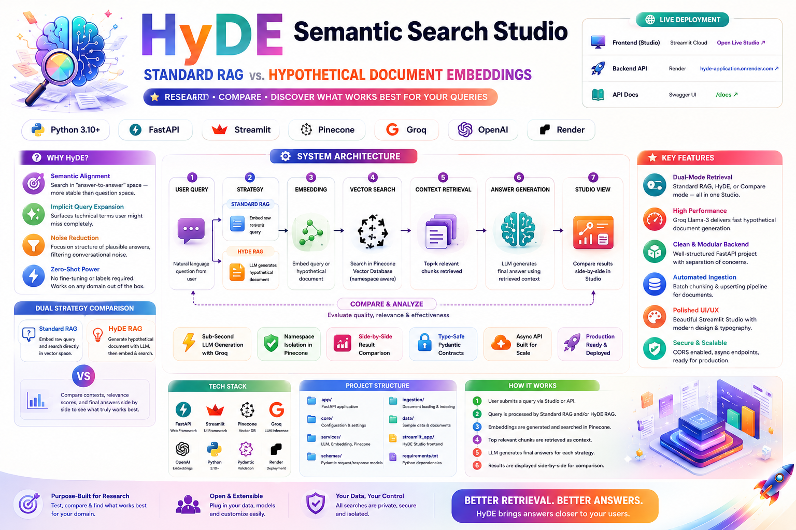
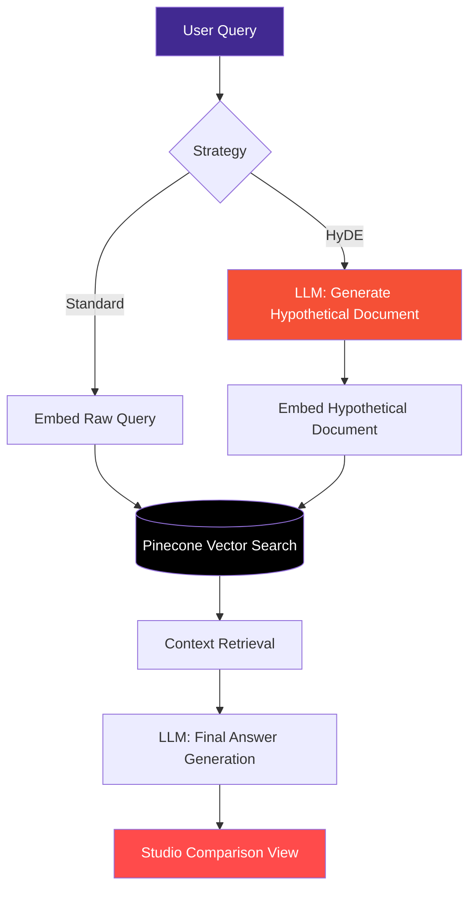

# 🧬 HyDE Semantic Search Studio — Standard RAG vs. Hypothetical Document Embeddings
<div align="center">
 

 
### 🌐 Live Deployment
 
| Service | URL | Platform |
|---|---|---|
| 🖥️ **Frontend** | [Open Live Studio ↗](https://hyde-application-ngutenxj5mshhvvqkfgbay.streamlit.app/) | Streamlit Cloud |
| 🚀 **Backend API** | [hyde-application.onrender.com ↗](https://hyde-application.onrender.com) | Render |
| 📚 **API Docs** | [/docs ↗](https://hyde-application.onrender.com/docs) | Swagger UI |



 


 
</div>

---


## 🧭 Overview

Standard RAG pipelines embed a user's raw query and search directly against a vector index. This works well when queries are long and descriptive — but it breaks down when queries are short, ambiguous, or keyword-sparse, because a *question* and its *answer* often don't live near each other in embedding space.

**HyDE Semantic Search Studio** solves this by generating a **hypothetical answer document** for every query using an LLM (Groq/Llama-3), then embedding *that* document instead of the raw query. The result is retrieval that operates in "answer-to-answer" space rather than "question-to-answer" space — which is inherently more stable in high-dimensional vector representations.

This project isn't just a HyDE implementation — it's a **research studio**: every query is run through both strategies simultaneously so you can directly compare retrieved context, relevance scores, and final answers.

---

## 🧪 Why HyDE? Beyond Keyword Matching

Standard RAG often fails when user queries are short, ambiguous, or keyword-sparse. HyDE bridges this gap by transforming a raw query into a technical, factual passage using a generative model, then using *that* passage — not the original query — as the basis for vector search.

**Core insights:**

1. **Semantic Alignment** — HyDE shifts search from "question-to-answer" to "answer-to-answer" space, which is inherently more stable in high-dimensional vector representations.
2. **Implicit Query Expansion** — The hypothetical document acts as a natural query expansion, surfacing technical terminology the user may have omitted entirely.
3. **Noise Reduction** — By focusing on the *structure* of a plausible technical answer, the system filters out conversational noise present in raw user queries.
4. **Zero-Shot** — No fine-tuning or labeled query-answer pairs required; the hypothetical generator works out of the box on any domain.

---

## 🗺️ System Architecture



**Request flow:**

1. A user submits a natural-language query through the Streamlit Studio or directly via the API.
2. Depending on the selected strategy (`standard`, `hyde`, or `compare`), the query is either embedded directly or first expanded into a hypothetical answer by Groq's Llama-3.
3. The resulting vector is used to query Pinecone's serverless index for the most relevant chunks.
4. Retrieved context is passed back to the LLM to synthesize a final, grounded answer.
5. In `compare` mode, both pipelines run concurrently and results are rendered side by side for direct evaluation.

---

## ✨ Features

- 🔄 **Dual-Mode Retrieval** — Toggle between Standard RAG, HyDE, or run both simultaneously in Compare mode.
- ⚡ **Sub-Second Generation** — Groq's Llama-3 inference keeps hypothetical document generation fast enough for real-time UX.
- 🧩 **Modular Backend** — Clean separation of API, business logic, config, ingestion, and schema validation.
- 🗂️ **Namespace-Aware Vector Store** — Pinecone serverless indexing supports multi-tenant / multi-collection isolation.
- 🎨 **Polished Studio UI** — Custom CSS-injected Streamlit interface with refined typography (JetBrains Mono + Plus Jakarta Sans).
- 🔐 **Type-Safe Contracts** — Pydantic schemas enforce strict request/response validation across the API.
- 📥 **Automated Ingestion Pipeline** — Batch chunking and upserting of documents into the vector store.
- 🌍 **CORS-Enabled Async API** — Production-ready FastAPI backend built for asynchronous workloads.

---

## 📁 Repository Structure

```
HyDE-Application/
├── backend/
│   ├── main.py         # API Gateway — Standard, HyDE & Comparison endpoints
│   ├── helper.py        # Core logic — embedding, hypothetical generation, Pinecone search
│   ├── config.py        # Singleton-pattern resource manager for Groq, OpenAI & Pinecone clients
│   ├── ingest.py        # Data pipeline — batch chunking & upserting into the vector store
│   ├── schemas.py        # Pydantic models for request/response validation
│   └── requirements.txt
├── frontend/
│   ├── app.py            # Streamlit Studio UI — side-by-side RAG comparison
│   └── requirements.txt
├── main.py               # Root entry point — global environment & dependency management
├── .env.example
└── README.md
```

| Directory | File | Functional Role |
| --- | --- | --- |
| `backend/` | `main.py` | **API Gateway** — orchestrates Standard, HyDE, and Comparison endpoints |
| `backend/` | `helper.py` | **Core Logic** — implements embedding, hypothetical generation, and Pinecone search |
| `backend/` | `config.py` | **Resource Manager** — singleton-pattern initialization for Groq, OpenAI, and Pinecone |
| `backend/` | `ingest.py` | **Data Pipeline** — automated batch upserting of semantic chunks to the vector store |
| `backend/` | `schemas.py` | **Type Safety** — Pydantic models for strict request/response validation |
| `frontend/` | `app.py` | **Studio UI** — sophisticated Streamlit interface with custom CSS for side-by-side RAG analysis |
| Root | `main.py` | **Entry Point** — global environment and dependency management |

---

## ⚡ Tech Stack

| Layer | Technology | Implementation Details |
| --- | --- | --- |
| **Language Model** | Groq (Llama-3) | Sub-second inference for hypothetical document generation and final answer synthesis |
| **Embeddings** | OpenAI `text-embedding-3-small` | High-dimensional semantic mapping (1536 dimensions) |
| **Vector Database** | Pinecone | Serverless vector indexing with namespace support for multi-tenant isolation |
| **Backend** | FastAPI | Asynchronous RESTful architecture with CORS middleware |
| **Frontend** | Streamlit | Custom CSS-injected UI with JetBrains Mono and Plus Jakarta Sans typography |
| **Validation** | Pydantic | Strict schema enforcement on all API boundaries |

---

## 🚀 Quickstart

### Prerequisites

- Python 3.10+
- API keys for **Groq**, **OpenAI**, and **Pinecone**

### 1. Clone & Configure

```bash
git clone https://github.com/paras160500/HyDE-Application.git
cd HyDE-Application
cp .env.example .env
```

Fill in your `.env` with the required keys (see [Environment Variables](#-environment-variables)).

### 2. Launch the Backend

```bash
cd backend
pip install -r requirements.txt
python main.py
```

The API will be available at `http://localhost:8000` (interactive docs at `/docs`).

### 3. Ingest Your Data

```bash
python ingest.py --source ./data --namespace default
```

### 4. Launch the Studio Frontend

```bash
cd frontend
pip install -r requirements.txt
streamlit run app.py
```

The Studio will open at `http://localhost:8501`.

---

## 🔑 Environment Variables

Create a `.env` file in the project root (see `.env.example`) with the following:

| Variable | Description | Required |
| --- | --- | --- |
| `GROQ_API_KEY` | API key for Groq Llama-3 inference | ✅ |
| `OPENAI_API_KEY` | API key for OpenAI embeddings | ✅ |
| `PINECONE_API_KEY` | API key for Pinecone vector database | ✅ |
| `PINECONE_INDEX_NAME` | Target Pinecone index name | ✅ |
| `PINECONE_ENVIRONMENT` | Pinecone deployment region/environment | ✅ |
| `BACKEND_URL` | Backend base URL consumed by the Streamlit frontend | ✅ |

---

## 📡 API Reference

Base URL: `https://hyde-application.onrender.com` (or `http://localhost:8000` locally)

### `POST /query/standard`

Runs a standard RAG query — embeds the raw query and retrieves matching context.

```json
{
  "query": "How does gradient descent converge?",
  "top_k": 5
}
```

### `POST /query/hyde`

Runs a HyDE query — generates a hypothetical answer document, embeds it, and retrieves context based on that embedding.

```json
{
  "query": "How does gradient descent converge?",
  "top_k": 5
}
```

### `POST /query/compare`

Runs **both** strategies concurrently and returns results side by side for direct comparison.

```json
{
  "query": "How does gradient descent converge?",
  "top_k": 5
}
```

> Full interactive documentation, request/response schemas, and try-it-out functionality are available at [`/docs`](https://hyde-application.onrender.com/docs).

---

## 💡 Usage Examples

**cURL:**

```bash
curl -X POST "https://hyde-application.onrender.com/query/compare" \
  -H "Content-Type: application/json" \
  -d '{"query": "explain vector quantization", "top_k": 5}'
```

**Python:**

```python
import requests

response = requests.post(
    "https://hyde-application.onrender.com/query/compare",
    json={"query": "explain vector quantization", "top_k": 5}
)
print(response.json())
```

---

## 🛣️ Roadmap

- [ ] Support for additional embedding providers (Cohere, Voyage AI)
- [ ] Reranking layer (e.g., Cohere Rerank) post-retrieval
- [ ] Quantitative evaluation harness (Recall@K, MRR) comparing Standard vs. HyDE
- [ ] Support for multi-hop / iterative HyDE generation
- [ ] Dockerized one-command deployment

---

## 🤝 Contributing

Contributions are welcome! To contribute:

1. Fork the repository
2. Create a feature branch (`git checkout -b feature/amazing-feature`)
3. Commit your changes (`git commit -m 'Add amazing feature'`)
4. Push to the branch (`git push origin feature/amazing-feature`)
5. Open a Pull Request

Please open an issue first for major changes to discuss what you'd like to modify.

---

## 📜 License

This project is licensed under the **MIT License**. See the `LICENSE` file for details.

---

## 🙏 Acknowledgements

- [Gao et al., "Precise Zero-Shot Dense Retrieval without Relevance Labels"](https://arxiv.org/abs/2212.10496) — the original HyDE paper
- [Groq](https://groq.com/) for blazing-fast LLM inference
- [Pinecone](https://www.pinecone.io/) for serverless vector search
- [OpenAI](https://openai.com/) for embedding models

---

<div align="center">

Developed with ❤️ by **[Paras Patel](https://github.com/paras160500)**

Part of the **[Hands-On-RAG-Full](https://github.com/paras160500/Hands-On-RAG-Full)** series

⭐ If you find this project useful, consider giving it a star!

</div>
